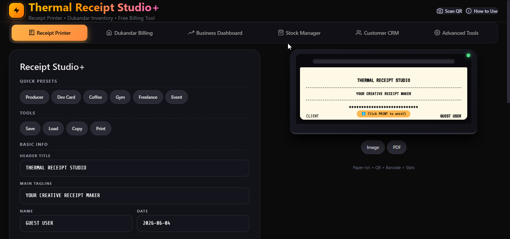
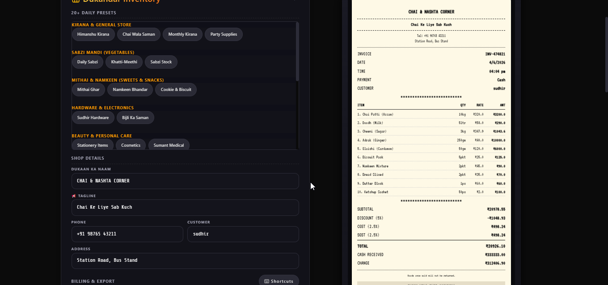
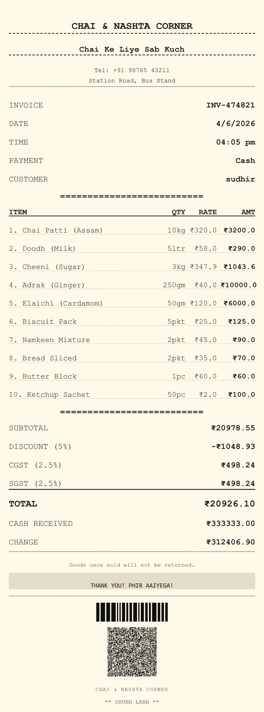
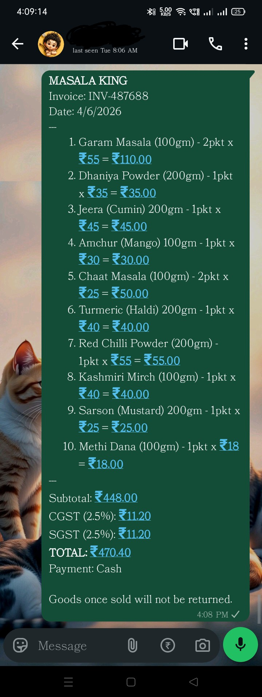
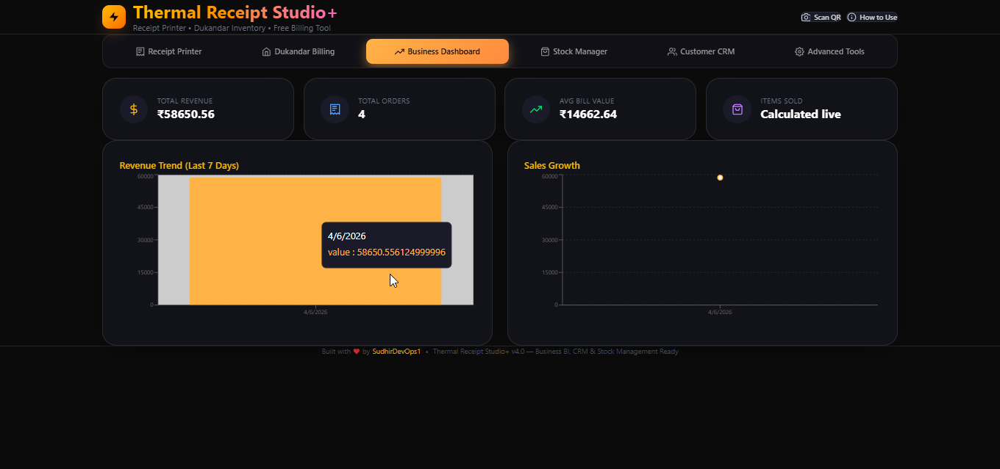

# Thermal Receipt Studio+

[](https://opensource.org/licenses/MIT)
[](https://github.com/SudhirDevOps1/Thermal-Receipt-Studio-)
[](https://thermal-receipt-studio.vercel.app/)

**Thermal Receipt Studio+** is a comprehensive, browser-based Point of Sale (POS) and billing suite designed for small businesses, shopkeepers, and freelancers. It enables users to generate professional thermal receipts, manage inventory, track customers, and analyze business performance entirely offline within the browser.

> **Live Demo:** [thermal-receipt-studio.vercel.app](https://thermal-receipt-studio.vercel.app/)
> **Author:** [SudhirDevOps1 (Sudhir Developer)](https://github.com/SudhirDevOps1)

---
## 📸 App Preview

> *Replace `img1.png` through `img5.png` in the `image/` folder with your actual screenshots to showcase the UI.*

| Home Dashboard | Billing & Inventory | Receipt with QR |
| :---: | :---: | :---: |
|  |  |  |
| *Clean dark UI with dual-tool tabs* | *Line-by-line billing with GST* | *Scannable QR with full invoice details* |

| Export & Share | History & Analytics |
| :---: | :---: |
|  |  |
| *PDF, Image, WhatsApp sharing* | *Business BI, Stock & CRM* |
## ✨ Key Features

### 🧾 Billing & Receipts
- **Thermal Receipt Generator:** Create stylish, print-ready receipts.
- **Dukandar Inventory Billing:** Professional GST invoicing (CGST/SGST) with line-by-line items.
- **25+ Ready Presets:** Pre-loaded templates for Kirana, Clothes, Clinics, Hardware, etc.
- **Smart QR Codes:** Generate detailed bill QRs (shows all items/date/total when scanned) or UPI Payment QRs.
- **Multi-Currency & Bilingual:** Supports INR, USD, EUR, etc., with English/Hindi toggle.

### 📊 Business Intelligence & Management
- **Real-Time Dashboard:** Visualize revenue trends, total orders, and average bill value.
- **Stock Manager:** Track inventory levels with automatic low-stock alerts.
- **Customer CRM:** Manage client databases, track visit history, and store birthdays.

### 🚀 Advanced Tools & Integrations
- **E-Invoicing (IRN) Ready:** Local IRN simulator for testing government e-invoice workflows.
- **Template Marketplace:** Import/Export community-designed receipt templates.
- **OCR Intake:** Parse physical receipt text to auto-populate item lists.
- **Hardware Readiness:** Check WebUSB/WebHID support for thermal printers and barcode scanners.
- **Offline Data Pack:** Export all business data (receipts, stock, CRM) for cloud backup.

---

## 🛠️ Tech Stack

- **Frontend:** React, TypeScript, Vite
- **Styling:** Tailwind CSS, Custom CSS Animations
- **Data Visualization:** Recharts
- **Utilities:** 
  - `qrcode` (Robust QR generation)
  - `html2canvas` (DOM to Image conversion)
  - `jspdf` (PDF generation)
  - `html5-qrcode` (Camera scanning)

---

## 🚀 Getting Started

Follow these instructions to get a copy of the project up and running on your local machine for development and testing purposes.

### Prerequisites
- Node.js (v16 or higher)
- npm or yarn

### Installation

1. **Clone the repository**
   ```bash
   git clone https://github.com/SudhirDevOps1/Thermal-Receipt-Studio-.git
   cd Thermal-Receipt-Studio-
   ```

2. **Install dependencies**
   ```bash
   npm install
   ```

3. **Start the development server**
   ```bash
   npm run dev
   ```
   Open [http://localhost:5173](http://localhost:5173) to view it in the browser.

4. **Build for production**
   ```bash
   npm run build
   ```

---

## 📚 Documentation

- **[GUIDE.md](./GUIDE.md)**: Complete user guide for Billing, Inventory, and CRM.
- **[ADVANCED_TOOLS.md](./ADVANCED_TOOLS.md)**: Detailed guide on using the Advanced Tools tab (IRN, OCR, Hardware checks, etc.).

---

## 🤝 Contributing

Contributions are what make the open-source community such an amazing place to learn, inspire, and create. Any contributions you make are **greatly appreciated**.

1. Fork the Project
2. Create your Feature Branch (`git checkout -b feature/AmazingFeature`)
3. Commit your Changes (`git commit -m 'Add some AmazingFeature'`)
4. Push to the Branch (`git push origin feature/AmazingFeature`)
5. Open a Pull Request

---

## 📄 License

Distributed under the MIT License. See `LICENSE` for more information.

**Built with ❤️ by SudhirDevOps1**
